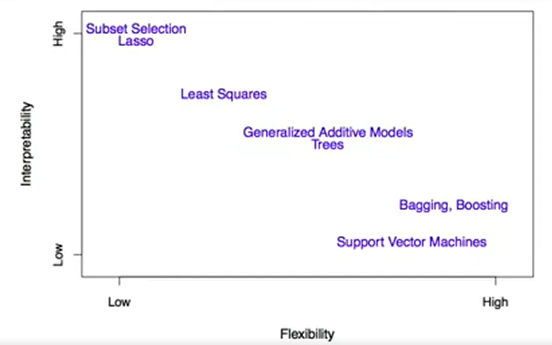

# Intro to Statistical Learning
## Supervised Learning
### Concepts
- Outcome measurement ($Y$): dependent variable/response/target
- Vector of $p$ predictor measurements ($X$): inputs/regressors/covariates/features/independent variables
- **Regression problem**: $Y$ is quantitative
- **Classification problem**: $Y$ takes values in a finite unorded set (class)

Objectives:
- Accurately predict unseen test cases
- Understand which inputs affect the outcome and how
- Assess the quality of the predictions

### Supervised x Unsupervised Learning
**Supervised Learning**: the outcome measurement is given and it's supposed to be predicted to by itss features

**Unsupervised Learning**: there is no outcome variable (data is unlabeled), just a set of predictors/features measured on a set of samples, and they are put together based on similar features

## Regression Models
Suppose 3 graphics: Salves vs TV, Radio and Newspaper, each with a linear-regression line fit. How can we predict Sales as a function of those three features?

Here, Sales is our $Y$, and our *input vector* is $X = \begin{pmatrix} X_1 \\ X_2 \\ X_3 \end{pmatrix}$, $X_1$ the TV, $X_2$ Radio and $X_3$ Newspaper.

Our model is $Y = f(X) + \epsilon$, $\epsilon$ the measurement errors and other discrepancies.

If our model is good, we can make predictions of $Y$ at new points $X = x$ and understand how $X_i$ affects $Y$.

A good value for $f(x) = E(Y | X = x)$, aka the $expected value$ (average), which is called *regression function*. For our vector $X$, $f(x) = f(x_1, x_2, x_3) = E(Y | X_1 = x_1, X_2 = x_2, X_3 = x_3)$.

The *ideal/optimal* predictor of $Y$ is the function that minimizes $E[(Y - g(X))^2 | X = x]$ over all functions $g$ at all points $X = x$.

$\epsilon = Y - f(x)$ is the $irreducible error of $f$.

For any estimate $\hat{f}(x)$ of $f(x)$, we have $E[ (Y - \hat{f}(X))^2 | X = x ] = [f(x) - \hat{f}(x)]^2 + \text{Var}(\epsilon)$, $[f(x) - \hat{f}(x)]^2$ reducible and $\text{Var}(x)$ irreducible.

### How to estimate $f$
We usually can't compute $E(Y | X = x)$ because we only have few if any data points with exxact $x$. Therefore, we let $\hat{f}(x) = \text{Ave}(Y | X \in N(x))$, where $N(x)$ is some *neighbourhood* of $x$ (**nearest neighbour**/**local averaging**). 

This method is great for $p \le 4$ and a large $N$ (*curse of dimensionality*: the higher the dimension, the higher the radius to get a % of the data).

### Parametric and Structured Models
#### Linear Model
$f_L (X) = \beta_0 + \beta_1 X_1 + \beta_2 X_2 + ... + \beta_p X_p$

A linear model is specified in terms of $p + 1$ parameters, which are estimated by fitting the model to training data.

Although it is almost never correct, it often serves as a good approximation to the unkown true function $f(X)$.

#### Thin-plate Spines
More complex and smooth curves.

#### Trade-offs
- Prediction accuracy x Interpretability: linear models are easier to interpret
- Good fit x Over-fit/Under-fit
- Parsimony x Black-box: a simpler model involving fewer variables is preferable over a black-box predictor

### Assessing Model Accuracy
Suppose we fit a model $\hat{f}(x)$ to some training data $\text{Tr} = \{x_i,y_i\}_l^N$ ($N$ data pairs $(x_i,y_i)$).

We could compute the average squared prediction error over Tr by $\text{MSE}_{\text{Tr}} = \text{Ave}_{i \in \text{Tr}}[y_i - \hat{f}(x_i)]^2$, which may be biasd toward more overfit models.

Instead, if possible, we should compute it using *fresh test data* $\text{Te} = \{x_i, y_i\}_l^M$ with $\text{MSE}_{\text{Te}} = \text{Ave}_{i \in \text{Te}}[y_i - \hat{f}(x_i)]^2$

### Bias-Variance Trade-off
Let $(x_0, y_0)$ be a the observation drawn from the population, $E(y_0 - \hat{f}(x_0))^2 = \text{Var}(\hat{f}(x_0)) + [\text{Bias}(\hat{f}(x_0))] + \text{Var}(\epsilon)$, where $\text{Bias}(\hat{f}(x_0)) = E[\hat{f}(x_0)] - f(x_0)$.

The expectation averages over the variability of $y_0$ as well as the variability in $\text{Tr}$. Typically as the *flexibility* of $\hat{f}$ increases, its variance increases, and its bias decreases. Choosing the flexibility based on average test error amounts to a **bias-variance trade-off**.

## Classification Problems
Here the response variable $Y$ is *qualitative*. Our goals are:
- Build a classifier $C(X)$ that assigns a class label from $C$ to a future unlabeled observation $X$
- Assess the uncertainty in each classification
- Understand the roles of different predictors among $X$

Suppose the $K$ elements in $C$ are numebered $1, 2, ..., K$, $p_k(x) = \text{Pr}(Y = k | X = x), k = 1, ..., K$ are the **conditional class probabilities** at $x$.

The **Bayes optimal** classifier at $x$ is $C(x) = j$ if $p_j(x) = \text{max}(p_1(x), p_2(x), ... , p_k(x))$.

Nearest-neighbor averaging can be used as before, with the same cons. Both Bayes and NN assign to the majority class.