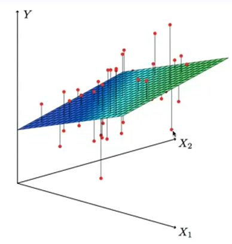

# Supervised Learning
## Linear Regression
It assumes the dependence of $Y$ on $X_1, ..., X_p$ is *linear*.

**Simple linear regression using a single predictor $X$**: we assume a model

$$Y = \beta_0 + \beta_1 X + \epsilon$$
 
where $\beta_0$ and $\beta_1$ are two unknown constants that represent the *intercept* and the *slope* (coefficients/parameters) and $\epsilon$ is the error term.

Given some estimates $\hat{\beta_0}$ and $\hat{\beta_1}$ for the model coefficients, we can predict future behavior using 

$$\hat{y} = \hat{\beta}_0  + \hat{\beta}_1 x$$

where $\hat{y}$ indicates a prediction of $Y$ on the basis of $X = x$.

### Estimation of Parameters by Least Squares
Let $\hat{y}_i = \hat{\beta}_0  + \hat{\beta}_1 x_i$ be the prediction for $Y$ based on the *i*-th value of $X$, then $e_i = y_i - \hat{y}_i$ (discrepancy between the actual outcome and the predicted one) represents the *i*-th **residual**.

The **residual sum of squares (RSS)** is defines as

$$ \text{RSS} = {e_1}^2 + {e_2}^2 + ... + {e_n}^2 $$

or equivalently as

$$ \text{RSS} = (y_1 - \hat{\beta}_0 - \hat{\beta}_1 x_1)^2 + (y_2 - \hat{\beta}_0 - \hat{\beta}_1 x_2)^2 + ... + (y_n - \hat{\beta}_0 - \hat{\beta}_1 x_n)^2 $$

The least squares approach chooses $\hat{\beta}_0$ and $\hat{\beta}_1$ to minimize the RSS, being

$$ \hat{\beta}_0 = \bar{y} - \hat{\beta}_1 \bar{x} $$

$$ \hat{\beta}_1 = \frac{\sum_{i=1}^n (x_i - \bar{x}) (y_i - \bar{y})}{\sum_{i=1}^n (x_i - \bar{x})^2} $$

where $\bar{y} = \frac{1}{n} \sum_{i = 1}^n y_i$ and $\bar{x} = \frac{1}{n} \sum_{i = 1}^n x_i$ are the sample means.

### Assessing the Accuracy of the Coefficient Estimates
The standard error of an estimator reflects how it varies under repeated sampling. We have

$$ \text{SE}(\hat{\beta}_0)^2 = \sigma^2 \bigg[\frac{1}{n} + \frac{\bar{x} ^ 2}{\sum_{i=1}^n (x_i - \bar{x})^2}\bigg] $$

$$ \text{SE}(\hat{\beta}_1)^2 = \frac{\sigma ^ 2}{\sum_{i=1}^n (x_i - \bar{x})^2} $$

where $\sigma ^ 2 = \text{Var}(\epsilon)$ (noise).

The more the noise, the bigger the error, and the more spread out the $x$ is along the horizontal, the more accurate (lower) the error is.

These standart errors can be used to compute **confidence intervals**. A $95%$ confidence interval is  defined as a range of values such that with $95%$ probability, the range will contain the true unknown value of the parameter. It has the form

$$ \hat{\beta}_1 \pm 2 \times \text{SE}(\hat{\beta}_1) $$

### Hypothesis Testing
Standard errors can also be used to perform *hypothesis tests* on the coefficients, the most common of which involves testing the *null hypothesis* of $H_0$ (there is no relationship between $X$ and $Y$ versus the *alternative hypothesis*, $\beta_1 = 0$) and $H_A$ (there is some relationship between $X$ and $Y$, $beta_1 \neq 0$).

To test the null hypothesis we compute a *t-statistic*, given by

$$ t = \frac{\hat{\beta}_1 - 0}{\text{SE}(\hat{\beta}_1)} $$

This will have a $t$-distribution with $n - 2$ degrees of freedom, assuming $\beta_1 = 0$. It is easy to compute the probability of observing any value equal to $|t|$ or larger (**p-value**).

### Assessing the Overall Accuracy of the Model
We compute the **Residual Standard Error**

$$ \text{RSE} = \sqrt{\frac{1}{n - 2}\text{RSS}} = \sqrt{\frac{1}{n - 2} \sum_{i=1}^n (y_i - \hat{y}_i)^2} $$

where the *residual sum-of-squares* is $\text{RSS} = \sum_{i=1}^n (y_i - \hat{y}_i)^2$.

R-squared or *fraction of variance explained* is

$$ R^2 = \frac{\text{TSS} - \text{RSS}}{\text{TSS}} = 1 - \frac{\text{RSS}}{\text{TSS}} $$

where $\text{TSS} = \sum_{i=1}^n (y_i - \bar{y})^2$ is the *total sum of squares*.

It can be shown in a simple linear regression setting that $R^2 = r^2$ where $r$ is the correlation between $X$ and $Y$.

## Multiple Linear Regression
Here our model has more than one predictor $X_j$ and is a plane/hyperplane

$$ Y = \beta_0 + \beta_1 X_1 + \beta_2 X_2 + ... + \beta_p X_p + \epsilon $$

We interpret $\beta_j$ as the average effect on $Y$ of a one unit increase in $X_j$, holding all other predictors fixed.

### Interpreting Regression Coefficients
The ideal scenario is when the predictors are uncorrelated between each other (*balanced design*):
- Each coefficient can be estimated and tested separately
- Interpretations such as the previous one are possible

Correlations amongst predictos cause problems, such as:
- The variance of all coefficients tends to increase, somtimes dramatically
- Interpretations become hazardous

Claims of *causality* should be avoided for observational data.

### Estimation and Prediction for Multiple Regression
We estimate $\beta_0, \beta_1, ..., \beta_p$ as the values that minimize the sum of squared residuals

$$ RSS = \sum_{i=1}^n (y_i - \hat{y}_i)^2 = \sum_{i=1}^n (y_i - \hat{\beta_0} - \hat{\beta_1} x_{i1} - \hat{\beta_2} x_{i2} - ... - \hat{\beta_p} x_{ip})^2 $$

The value of $\hat{\beta}$ that minimize $\text{RSS}$ are the multiple least squares regression coefficient estimates.