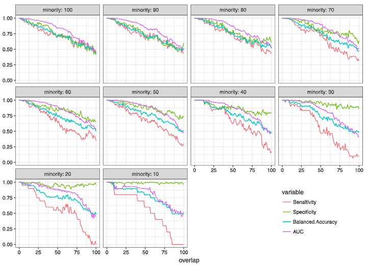
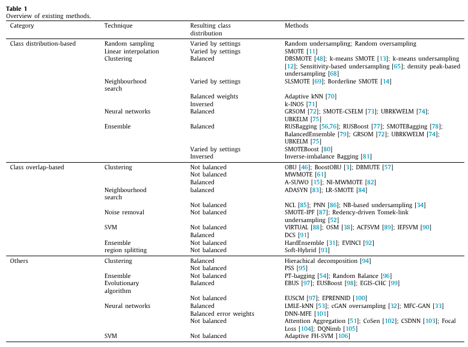
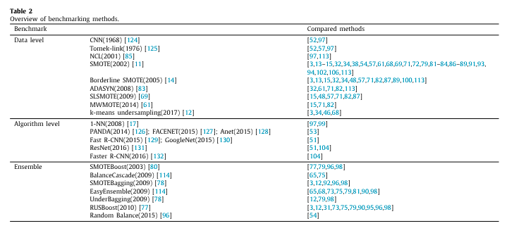
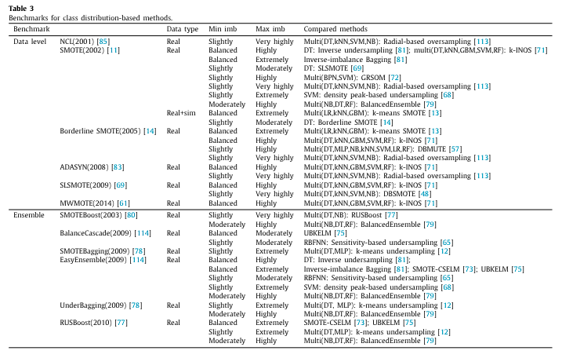
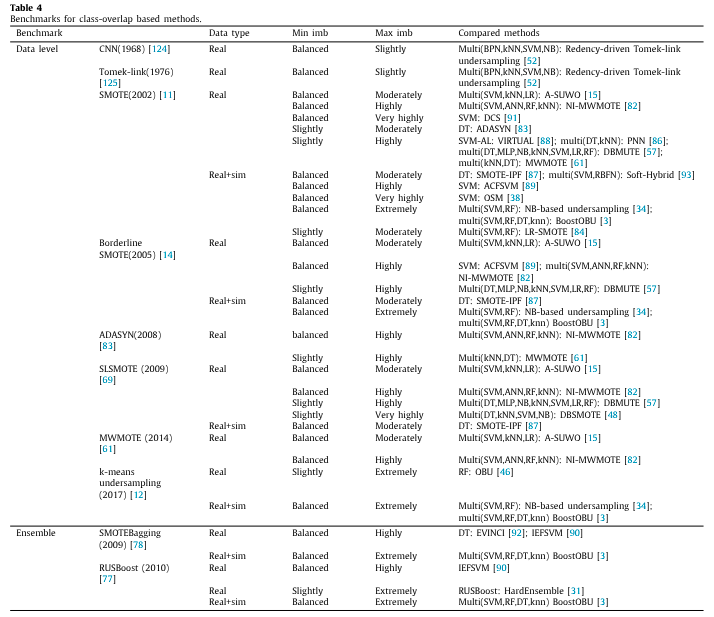
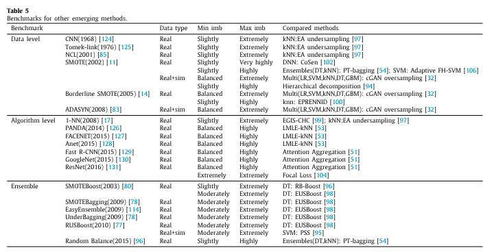

# On the class overlap problem in imbalanced data classification
## Abstract
Failure in classification of imbalanced datasets is not always caused by class imbalance solely. In fact, a linearly separable dataset can be perfectly classified by a typical classification algorithm no matter how skewed the class distribution is. On the contrary, when class overlap is present, even a balanced dataset can be difficult for a learning task.

Many traditional and recent resampling methods only aim at getting a more balanced version of the training data and do not factor in the problem of class overlap. Class overlap frequently shows the highest negative influence among potential factors including class imbalance.

The main objective of the solutions was considred and categorised them into class distribution-based and class overlap-based approaches for better comparing and contrasting the two approaches. Class distribution-based methods mainly concern and aim to suppress the problem of imbalanced class distribution. Class overlap-based methods focus on improving the visibility of instances, especially positive instances, in the overlapping region.

## Key definitions
### Class Imbalance
An imbalanced dataset is a dataset with an unequal distribution of classes. In machine learning, class imbalance becomes an issue when the minority class is significantly smaller in size and is the primary class of interest with a relatively high misclassification cost.

The degree of class imbalance can be measured as the imbalance ratio ($\text{imb}$) or the percentage of the minority class ($\text{\% minority}$), where $M$ and $m$ are the numbers of instances in the majority class and minority class, respectively.

$$ \text{imb} = \frac{M}{m} $$

$$ \text{minority(\%)} = \frac{m}{M} \times 100 $$

### Class Overlap
Class overlap occurs when instances of more than one class share a common region in the data space. These instances have similarities in feature values although they belong to different classes, and such a complication is a substantial obstacle in classification tasks.

There are multiple ways of measuring class overlap (each with its own drawbacks), but the one used int this study was

$$ \text{overlap (\%)} = \frac{\text{overlapping area}}{\text{minority class area}} \times 100 $$

### Evaluation Metrics
In imbalanced problems, accurate detection of minority class instances is crucial. This is usually evaluated in terms of **sensitivity**, which is also known as **true positive rate (TPR)** or **recall**.

$$ \text{sensitivity} = \frac{\text{TP}}{\text{TN} + \text{FP}} $$

$$ \text{specificity} = \frac{\text{TN}}{\text{TN} + \text{FP}} $$

**Balanced accuracy**/balanced mean accuracy/average accuracy/macroaccuracy is the arithmetic mean of the accuracy over each class. The traditional accuracy can be significantly misleading when class imbalance is high.

$$ \text{accuracy} = \frac{ \text{TP} + \text{TN} }{ \text{TP} + \text{FN} + \text{TN} + \text{FP} } $$

$$ \text{balance accuracy} = \frac{ \text{sensitivity} + \text{specificity} }{ 2 } $$

Another metric for evaluating the overall performance is **G-mean**. It is the geometric mean of sensitivity and specificity. Since both G-mean and balanced accuracy give the average values of sensitivity and specificity, they are often used interchangeably.

$$ \text{G-mean} = \sqrt{\text{specificity} \times \text{sensitivity}} $$

It can be seen that the difference between G-mean and balanced accuracy becomes greater when the difference between sensitivity and specificity increases. Thus, to determine a more suitable metric between G-mean and balanced accuracy, the user will need to carefully make a selection based on the application domain and the main objective of the classification task.

Another common metric, **F1-score**, is the harmonic mean of sensitivity and precision. However, unlike G-mean and balanced accuracy, F1-score takes into account of precision instead of specificity.

$$ \text{F1-score} = \frac{2}{\frac{1}{\text{sensitivity}} + \frac{1}{\text{precision}}} $$

$$ \text{precision} = \frac{\text{TP}}{\text{TP} + \text{FP}} $$

Precision is dependent of FP and TP. Since FP and TP are not normalised with respect to the class size, FP can be excessively higher than TP in an extremely imbalanced case. This high FP can be deceptive when in fact the false positive rate (FPR) is insignificant. In such case, precision is strongly influenced by FP and does not reflect the actual performance on the positive class. As a consequence, F1-score will be misleading.

Any two models that yield similar FP, TP and sensitivity, will have similar F1-score regardless of their difference in FPRs.

Another commonly-used metric is the **area under the receiver operating characteristic curve (AUC)**. A receiver operating characteristic curve (ROC) visualises the values of TPR against FPR at varying probability thresholds. AUC gives a summary of the ROC curve as a single value.

**In summary**, it is recommended that for evaluation of imbalanced dataset classification, individual class accuracy, especially sensitivity,is considered along with an overall performance measure such as balanced accuracy or G-mean. F1-score and AUC can also be assessed; however, they should be carefully discussed due to the constraints addressed above.

## Impacts of Class Overlap vs Class Imbalance
All approaches have shown theirvpotentials in improving classification results in different ways.
Countless variations of existing methods make it impossible to compare and find out which approach is better. Instead, we can consider the scale of effect of class imbalance in comparison to class overlap. This will advise which of the problems should be more concerning.

Random Forests (RF) was chosen as the learning algorithm for the following reasons. First, it is a representative of standard learning algorithms that aim at maximising the overall classification accuracy such as DT, SVM, neural net, naive bayes, etc. Second, RF is robust to overfitting, which helps minimise the effect of different sample sizes. Lastly, though RF is one of the most widely-used learning algorithms for classification of imbalanced datasets, it was not experimented in previous studies.

The datasets were partitioned into training and testing sets at the ratio of 80 to 20, and 10-fold cross-validation was applied for model selection. The resulting models were evaluated in terms of sensitivity, specificity, balanced accuracy, and AUC.

Classification results are shown in the image. It can be seen that both class imbalance and class overlap caused degradation in sensitivity. However, changes in the imbalance degree barely showed an effect on sensitivity when imbalance and overlap were not very high. This is evidenced at %minority = 70 to 100, where it is not apparent that sensitivity values were impacted by a change in class imbalance when %overlap = 0 to 50.

At higher imbalance degrees, the drops in sensitivity due to class imbalance became more clearly visible. At %overlap = 0 to 25, there were no apparent differences in sensitivity at different imbalance degrees, except at high imbalance, i.e %minority = 10 and 20. This can be attributed to the effect of sample size. That is, at lower imbalance degrees, the sample sizes were larger, which might be sufficient to suppress the effect of class imbalance. Finally, the effect of class imbalance was more obvious when the overlap degree was higher. These results suggest that the impact of class imbalance on sensitivity highly depended on the level of class overlap as well as the sample size.

On the other hand, class overlap clearly degraded sensitivity at all degrees. A higher decrease in sensitivity per change in %overlap can be seen when class imbalance was high enough. It is worth pointing out that even with no presence of class imbalance (%minority = 100), the influence of class overlap on sensitivity was apparent. In contrast, when there was no class overlap, the ideal sensitivity value was achievable regardless of imbalance degrees.

**Thus, it can be said that the effect of class imbalance is dependent on the presence of class overlap, but not the other way around. Finally, all of these results suggest that class overlap hurts sensitivity more than class imbalance.**

Specificity was negatively affected by class overlap due to the decrease in visibility of majority class instances. It can be observed that class overlap had a higher impact on sensitivity than on specificity. This was because class overlap was measured with respect to the data space of the minority class. Thus, the overlapping region occupied a larger data space of the minority class than that of the majority class, relatively to the class size. In an extreme case, the overlapping region occupied the entire minority class but only some part of the majority class.

## Existing Solutions

### Class distribution-based Methods
Methods that are designed to reduce the bias in class distribution. Resampling of data is the most common approach, but undersampling can potentially lead to a loss of important information while oversampling is prone to overfitting. Moreover, it doesn't always guarantee better results.

### Class overlap-based Methods
Most existing overlap-based methods focused specifically on borderline instances, whereas few dealt with the entire overlapping region. **Overlap-Based Undersampling(OBU)** (and variations) worked well, but **neighbourhood-based undersampling frameworks** methods got superior results over OBU suggesting that under the same objective to maximise the presence of minority class instances, a NB-based framework, which uses a more local technique, was more efficient. However, these NB-based methods are solely based on Euclidean distance. There may be some variations in results on real-world problems due to other data characteristics such as density and class densities, which was not considered in the work.

An ensemble-based method, **HardEnsemble**, incorporating both oversampling and undersampling to address overlapped instances of both classes was tested and it  showed comparable performance with other solutions. Moreover, it has a benefit over
many other existing solutions of no parameter tuning required.

A modified version of **Neighbourhood Cleaning (NCL)** proposed by Liang also had good results. A modification of kNN to improve the classification of imbalanced datasets, **Positive-biased Nearest Neighbour (PNN)**, was
also analysed. The classification decision was adjusted to
be biased towards the positive class, particularly in the regions
where positive instances were found under-represented. This
benefited the positive class, especially in the overlapping region.
The method showed superior performance over other neighbourhood-based algorithms with a significantly lower computational cost.

### Emerging Methods

## Conclusions
In general, the choice of suitable
methods will vary across problems due to different misclassification costs and variations in objectives or requirements of the
users. However, based on the experimental results, the problem
of class overlap should be addressed in all cases whereas handling
class imbalance may not be necessary. 

Suggested approaches are
as follows:
- When there is no class overlap, classification tasks can be
handled using standard learning algorithms regardless of
the imbalance degree. Thus, no application of additional
methods is needed.
- For datasets with slight to moderate imbalance degrees,
overlap-based methods are likely to be a better approach
when improvement in sensitivity is expected. Also, those
methods with no concern of rebalancing the class distribu-
tion may be preferable since results show clearly that in
such scenarios, class imbalance barely has an impact on the
learner’s performance.
- For highly imbalanced datasets, both class imbalance and
class overlap should be addressed. Thus, overlap-based
methods that also rebalance the class distribution or class
weights are potentially more efficient in improving the
classification.

This finding emphasises that more research effort is put into
improving class overlap-based algorithms. Development of well-
formulated definition and measurement of class overlap, espe-
cially on real-world data, should as well be urgently put forward.
The overview of benchmarking methods show frequently-used
solutions for evaluation and comparison purposes, which can be
seen as good standards for future work. At the same time, some
of these methods are long-established and have been constantly
outperformed. This suggests the need for further comparison
against recent and state-of-the-art methods for more convincing
and reliable assessments.

Finally, the review also showed that emerging techniques
such as deep learning algorithms and evolutionary algorithms
have constantly gained the community’s attention. This is be-
cause they are self-learning and capable of providing optimal
results. Although the use of such algorithms has been widely proposed to address the class imbalance problem, class
overlap was rarely discussed. Also, these techniques have some
well-known limitations. Besides high computational complexity,
neural network-based techniques generally require large training
data, which is not often available in certain imbalanced domains,
e.g., medical-related fields. Thus, another possible future direction
may include the development of methods using emerging techniques, for example, GAN-based methods to deal with overlapped
instances of small-sized datasets.